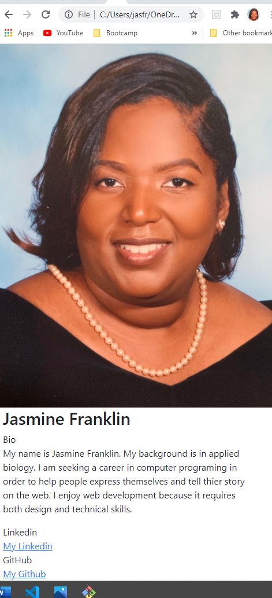

# Responsive Portfolio

Build a portfolio to showcase programing skills.

<br>

===========


<br>

## Navbar

```
<nav class="navbar navbar-expand-lg navbar-dar bg-light">
    <div class="container-fluid">
      <a class="navbar-brand navbrandstyle" href="#">About Me</a>
      <button class="navbar-toggler" type="button" data-toggle="collapse" data-target="#navbarNavAltMarkup" aria-controls="navbarNavAltMarkup" aria-expanded="false" aria-label="Toggle navigation">
        <span class="navbar-toggler-icon"></span>
      </button>
      <div class="collapse navbar-collapse" id="navbarNavAltMarkup">
        <div class="navbar-nav">
          <a class="nav-item nav-link active" href="index.html">Index</a>
          <a class="nav-item nav-link" href="portfolio.html">Portfolio</a>
          <a class="nav-item nav-link" href="contact.html">Contact</a>
        </div>
      </div>
    </div>
  </nav>
```
<br>

## Responsive Layout

```
  <main class="container"> 
    <div id="JasmineFranklin"></div>
      <div class="row">
        <div class="col-xs-12">
          <h1>Jasmine Franklin</h1>
        </div>
      <div class="row">
        <div class="col-sm-8">Bio</div>
        <div class="col-sm-4"><p> My name is Jasmine Franklin. My background is in applied biology. I am seeking a career in computer programing in order to help people express themselves and tell thier story on the web. I enjoy web development because it requires both design and technical skills. </p></div>
      </div>
      <div class="row">
        <div class="col-sm-8">Linkedin</div>
        <div class="col-sm-4"><a href="https://www.linkedin.com/in/jasmine-franklin-8b08ba121/"> My Linkedin</a></div>
      </div>
      <div class="row">
        <div class="col-sm-8">GitHub</div>
        <div class="col-sm-4"><a href="https://github.com/"> My Github</a></div>
      </div>
    </div>
  </main>
```
<br>

## Responsive Images

```
  
```

<br>

## Built With

* [HTML](https://developer.mozilla.org/en-US/docs/Web/HTML)
* [CSS](https://developer.mozilla.org/en-US/docs/Web/CSS)
* [Javascript](https://developer.mozilla.org/en-US/docs/Web/JavaScript)
* [Bootstrap](https://getbootstrap.com/)

## Deployed Link

* [See Live Site](https://jas-f.github.io/responsive-portfolio/)

## License

This project is licensed under the MIT License 

See also the list of [contributors](https://github.com/your/project/contributors) who participated in this project.

## Prerequisites

Git hub
Git lab
Git bash
Visual studio
Google chrome
Bootstrap
## Authors

**Jasmine Franklin C:301-332-2313 E:jasminer.franklin@gmail.com** 

- [Link to Portfolio Site](https://jas-f.github.io/responsive-portfolio/)
- [Link to Github](https://github.com/)
- [Link to LinkedIn](https://www.linkedin.com/in/jasmine-franklin-8b08ba121)

<p>&copy; UC Berkeley Extension Bootcamp.</p>


